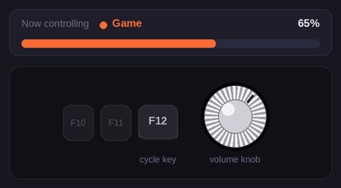

# KnobMixer

**Free per-app volume control for keyboard knobs & hotkeys — Windows**

Control the volume of individual apps independently. Turn one knob for your game, another for Discord, another for your browser — all at the same time.

### [⬇️ Download Latest Version](https://github.com/KnobMixer/KnobMixer/releases/latest/download/KnobMixer_Setup.exe)

**Requires:** Windows 10 or 11 (64-bit)

---

### ⚠️ First launch: Windows may show a warning

KnobMixer is a new app and isn't yet recognized by Microsoft SmartScreen, so Windows may show a **"Windows protected your PC"** screen the first time you run the installer. This is normal for new apps that aren't code-signed yet — it isn't a virus warning.

To continue: click **More info → Run anyway**.

---

## Quick start

If your knob **already controls your PC volume**, you're 30 seconds away:

1. Open KnobMixer and enable **Hardware Knob** at the top of the main window.
2. Set your **Cycle key**.
3. Add your apps to whichever groups you want.

That's it. For full customization (custom keys, multiple knobs), follow the guide below — or just run the built-in setup guide that opens on first launch.

---

## Setup (takes 1–2 minutes)

**Step 1 — Program your keyboard in your keyboard's software** *(skip if your knob can't be remapped — see below)*

<table>
<tr>
<td valign="top">

**1-Knob Mode**

| Action | Key |
|---|---|
| Knob left (Vol−) | F13 |
| Knob right (Vol+) | F14 |
| Knob click (Cycle groups) | F15 |
| Mute key | F16 |

</td>
<td valign="top">

**Multiple Knobs Mode**

| Action | Key |
|---|---|
| Knob left (Vol−) | F13 |
| Knob right (Vol+) | F14 |
| Knob click (Mute) | F15 |

</td>
</tr>
</table>

> 💡 Map your knob to spare keys you don't use elsewhere (**F13–F24** are ideal) so nothing clashes with other apps. Avoid keys like F12, which some apps use (e.g. Steam screenshots).

> 💡 In Multiple Knobs mode, set the music knob's click to **Play/Pause** in your keyboard software — it'll pause the song instead of muting the audio.

**Step 2 — Choose your mode**

- **1-Knob mode** — one knob controls all groups; press the Cycle key to switch between them.
- **Multiple Knobs** — each group has its own hotkeys. Best if you have 2 or more knobs.

**Step 3 — Set your hotkeys**

In KnobMixer, assign the keys from Step 1 to your groups. In 1-Knob mode, the shared keys appear above the groups on the main window.

**Step 4 — Add your apps**

Click **Edit** on each group and add the apps it should control (e.g. `spotify`, `discord`, `cs2`). Any app that's currently playing shows up in the list for one-click adding.

---

## Hardware knob that can't be remapped? (e.g. AULA F75)

Enable **Hardware Knob** in Settings → 1-Knob Mode. KnobMixer intercepts the system volume keys your knob sends and redirects them to your active group — your Windows system volume stays untouched.

---

## Why KnobMixer?

- Control multiple apps at once
- Works in fullscreen games
- Instant response, lightweight (~0% CPU idle)
- No ads, no tracking, no login

---

## No knob? No problem.

KnobMixer works with any hotkey combination — keyboard shortcuts, stream deck keys, or mouse buttons.

---

**License:** Business Source License 1.1 — free for personal use. Commercial use or competing products require written permission.

[Report a bug](https://github.com/KnobMixer/KnobMixer/issues) · [Releases](https://github.com/KnobMixer/KnobMixer/releases)

