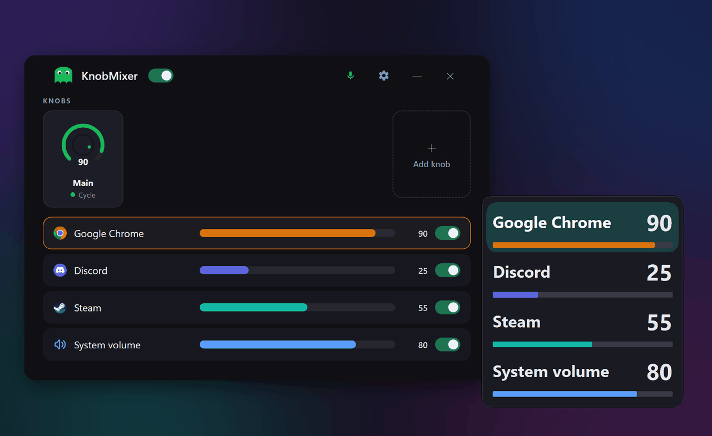

<h1 align="center">KnobMixer</h1>

KnobMixer gives you audio control using your keyboard knob. Turn your volume knob into a mixer for your apps — cycle between them with a click.

<b><a href="https://github.com/KnobMixer/KnobMixer/releases/latest/download/KnobMixer_Setup.exe">Download for Windows</a></b> 
Free · Windows 10/11

> ⚠️ **Heads up — first launch:** Windows may show a blue **"Windows protected your PC"** screen. This is normal for a newly released app — click **More info**, then **Run anyway**.

## 4 types of knobs

- **Cycle** — cycle through open apps playing audio
- **Specific apps** — controls only the apps you assign to this knob
- **System volume** — controls the Windows master volume
- **Active Window** — always controls the app currently in focus

## Contact

Questions, feedback, or a bug to report? Email [support@knobmixer.com](mailto:support@knobmixer.com).

## Privacy & License

[Privacy Policy](PRIVACY.md) · KnobMixer is free to use — see the [EULA](EULA.txt)

## Support the project

If KnobMixer saves you time, you can [buy me a coffee on Ko-fi](https://ko-fi.com/knobmixer) ☕
